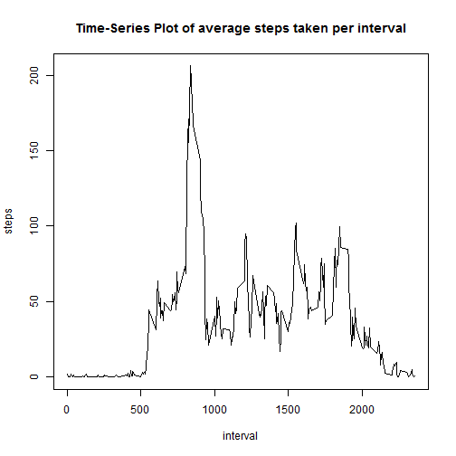

##Title: "ReproducibleResearchPeerAssessment1"


###Reading the activity data

```r
library(knitr)
url<-"https://d396qusza40orc.cloudfront.net/repdata%2Fdata%2Factivity.zip"
if(!file.exists("ActivityMonitorData.zip")){
  download.file(url, destfile="ActivityMonitorData.zip")  
  unzip("ActivityMonitorData.zip")
  }
ActivityData<-read.csv("activity.csv")
ActivityData1<-ActivityData[complete.cases(ActivityData),]
ActivityData1$date<-as.POSIXct(ActivityData1$date) 
```


###Creating data.frame with the total number of steps taken each day using the read activity data

```r
StepsPerDay1<-aggregate(steps~date,ActivityData1,sum)
```


###plotting Histogram of Total number of Steps taken per day over the 2-month period

```r
library(ggplot2)
qplot(steps,data=StepsPerDay1,geom=("histogram"),binwidth=1000)
```

 


###Mean and Median calculation

```r
MedianOfStepsPerDay1<-median(StepsPerDay1$steps)
MeanOfStepsPerDay1<-mean(StepsPerDay1$steps)
```
The mean of Total steps per day is **1.0766 &times; 10<sup>4</sup>**

The median of Total steps per day is **10765**


### Time-Series Plotting of Average steps taken in an interval over the 2-month time period

```r
AvgStepsinaInterval<-aggregate(steps~interval,ActivityData1,mean)
        
with(AvgStepsinaInterval,plot(interval,steps,xlab="interval",ylab="average steps",
main="Time-Series Plot of average steps taken in an interval",type="l"))
```

 


###Calculating 5-minute interval with the maximum number of steps

```r
x<-subset(AvgStepsinaInterval,steps==max(steps),select=interval)
```
The 5-minute interval, on average across all the days in the dataset, contains the maximum number of steps is **835**


###Calculating the total number of missing values (coded as NA)

```r
totalmissing<-sum(is.na(ActivityData))
```
The total number of missing values in the dataset 
(i.e. the total number of rows with NAs) are **2304**


###**Strategy for missing values** 
Missing values are filled by Mean steps in a time-interval

### Code to Fill in Missing step values

```r
ActivityData2<-ActivityData
for(i in 1:nrow(ActivityData2)){
    if (is.na(ActivityData2[i,1])== TRUE) {
        findinterval=ActivityData2[i,3]
ActivityData2[i,1]<- AvgStepsinaInterval[(AvgStepsinaInterval$interval==findinterval),2]
    } 
}
```


###Creating a data.frame with the total number of steps taken each day using after filling in missed values

```r
StepsPerDay2<-aggregate(steps~date,ActivityData2,sum)
```


###plotting Histogram of Total number of Steps taken each day after filling in missing values

```r
library(ggplot2)
qplot(steps,data=StepsPerDay2,geom=("histogram"),binwidth=1000)
```

 


###Mean and Median calculation

```r
MedianOfStepsPerDay2<-median(StepsPerDay2$steps)
MeanOfStepsPerDay2<-mean(StepsPerDay2$steps)
```
The mean of Total steps per day is **1.0766 &times; 10<sup>4</sup>**

The median of Total steps per day is **1.0766 &times; 10<sup>4</sup>**


###Differences in mean and median between data.frame with missing values for steps filled in vs data.frame with missing values for steps
Mean Value difference from first part of the assignment is 
**0**
Median Value difference from first part of the assignment is 
**1.1887**

The impact of filling in missing data is median is closer to mean
and between the 2 datasets the mean number of steps is the same


###Finding Day of a week and Weekday or a weekend and adding the columns to filled-in activity data.frame

```r
ActivityData2$date<-as.POSIXct(ActivityData2$date)
ActivityData2$day<-weekdays(ActivityData2$date)


for (i in 1:nrow(ActivityData2)){
    if (ActivityData2[i,4]=="Monday"){
        ActivityData2[i,5]="weekday"
    }
    if (ActivityData2[i,4]=="Tuesday"){
        ActivityData2[i,5]="weekday"
    }
    if (ActivityData2[i,4]=="Wednesday"){
        ActivityData2[i,5]="weekday"
    }
    if (ActivityData2[i,4]=="Thursday"){
        ActivityData2[i,5]="weekday"
    }
    if (ActivityData2[i,4]=="Friday"){
        ActivityData2[i,5]="weekday"
    }
    if (ActivityData2[i,4]=="Saturday"){
        ActivityData2[i,5]="weekend"
    }
    if (ActivityData2[i,4]=="Sunday"){
        ActivityData2[i,5]="weekend"
    }
}
```


###Creating a dataframe with average steps taken for an interval and weekend or weekday

```r
daysAVG<-aggregate(x=ActivityData2[,c(-2,-3,-4,-5)],
by=list(weekday=ActivityData2$V5,interval=ActivityData2$interval),FUN=mean, na.rm=T,simplify=T)
```


###Creating Time-Series plot for weekday and weekend days for an interval

```r
library(lattice)
daysAVG<-transform(daysAVG,weekday=factor(weekday))
xyplot(x~interval|weekday,data=daysAVG,layout=c(1,2),ylab="Avg Number of steps",type = "l")
```

 

